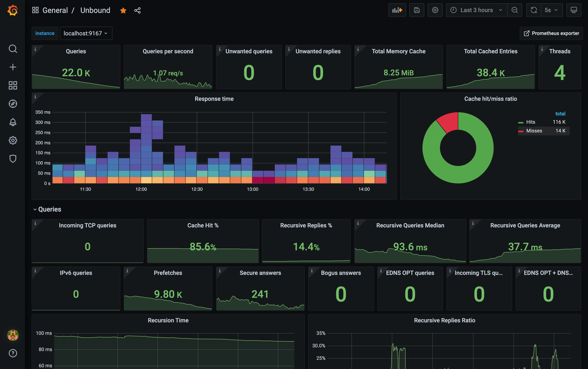
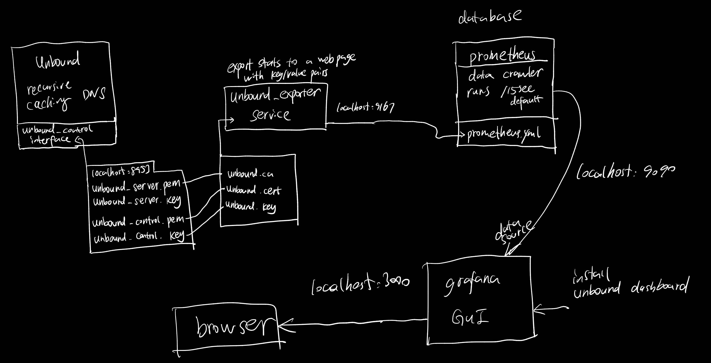
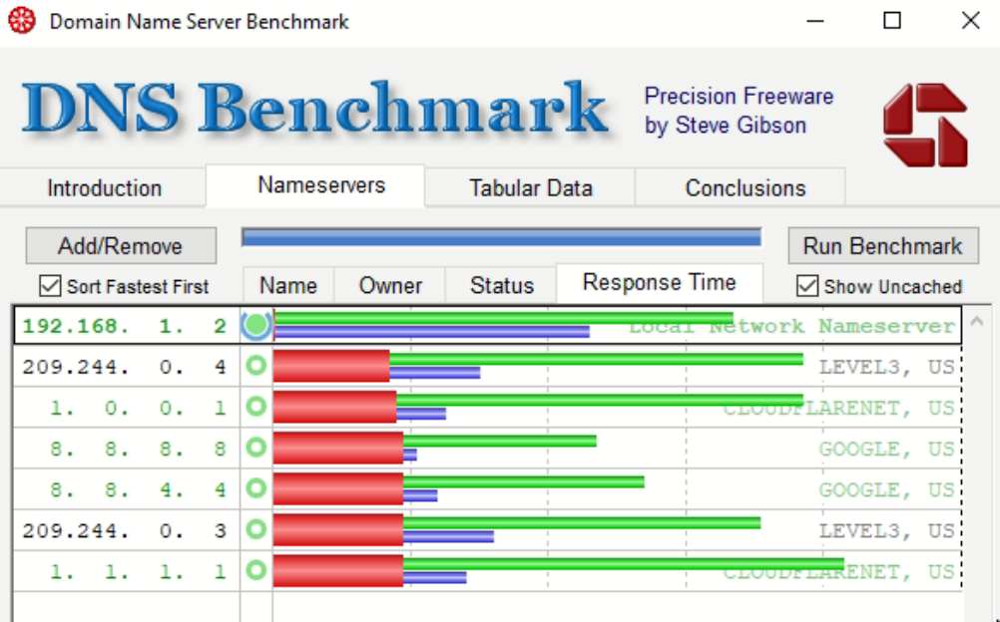

# Unbound Config

config files for unbound recursive dns and a dashboard config based on grafana, runnable on pi



dashboard: unbound panel: https://grafana.com/grafana/dashboards/11705

## Steps

general installations steps for ubuntu/debian distribution

1. install and config unbound, including setup new control certificate for the server (needed when exporting the stats with unbound_exporter)

   ```
   sudo apt-get install unbound
   sudo curl -o /var/lib/unbound/root.hints https://www.internic.net/domain/named.cache
   sudo cp unbound.conf /etc/unbound/unbound.conf.d/
   sudo systemctl enable unbound
   sudo service unbound restart
   ```

   * guide to configure unbound
     * https://calomel.org/unbound_dns.html
     * https://nlnetlabs.nl/documentation/unbound/unbound.conf/

   * to generate self-signing certificate for unbound control interface if you don't have any under /etc/unbound

     ````
     sudo unbound-control-setup
     ````
     
     this will generate `unbound_server.pem`, `unbound_server.key`, `unbound_control.pem`, `unbound_control.key`

2. install Grafana

   * https://grafana.com/docs/grafana/latest/installation/debian/

3. install PROMETHEUS

   `sudo apt-get install prometheus`

4. compile and install [unbound_exporter](https://github.com/kumina/unbound_exporter), which uses unbound control interface to export stats to a webpage

   ```
   go get github.com/kumina/unbound_exporter
   go install github.com/kumina/unbound_exporter
   sudo cp go/bin/unbound_exporter /usr/bin
   sudo cp go/bin/unbound_exporter /usr/sbin
   sudo cp unbound-exporter.service /lib/systemd/system/
   sudo systemctl enable unbound-exporter.service
   sudo service unbound-exporter restart
   ```

5. config PROMETHEUS file to use unbound_exporter as a source

   * `sudo cp prometheus.yml /etc/prometheus/`

   * may/maynot need to enable unbound scrap service in prometheus control panel at `http://pi_address:9090/targets`

6. in grafana(`http://pi_address:3000`): add data source -> prometheus in grafana web panel

   url: localhost:9090

7. install unbound panel

   manage panel->import->11075

8. after installation, grafana should be accessed at `http://pi_address:3000`

## Diagram



## Performance

performance over 400Mbps/?Mbps cable connecton



```
 Final benchmark results, sorted by nameserver performance:
 (average cached name retrieval speed, fastest to slowest)

  192.168.  1.  2 |  Min  |  Avg  |  Max  |Std.Dev|Reliab%|
  ----------------+-------+-------+-------+-------+-------+
  + Cached Name   | 0.000 | 0.000 | 0.002 | 0.000 | 100.0 |
  + Uncached Name | 0.016 | 0.067 | 0.279 | 0.065 | 100.0 |
  + DotCom Lookup | 0.018 | 0.046 | 0.088 | 0.026 | 100.0 |
  ---<O-OO---->---+-------+-------+-------+-------+-------+
```