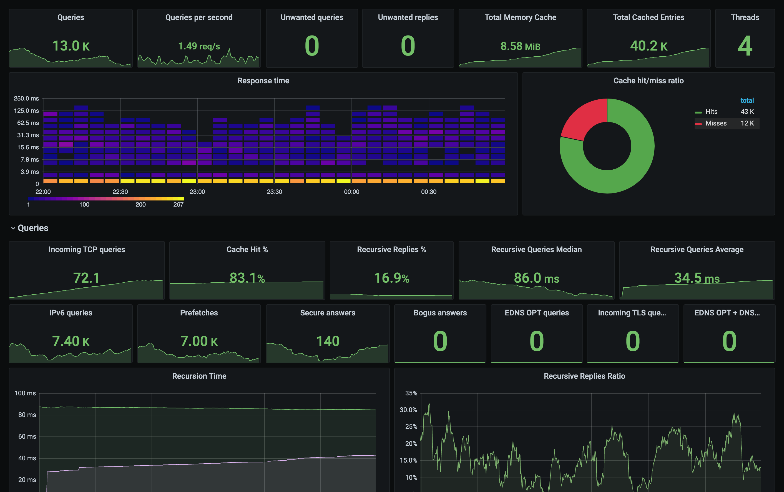

# Unbound Config

config files for unbound recursive dns and a dashboard config based on grafana, runnable on pi



dashboard: unbound panel: https://grafana.com/grafana/dashboards/11705

## Steps

1. install and config unbound, including setup new control certificate for the server (needed when exporting the stats with unbound_exporter)
2. install Grafana
3. install PROMETHEUS
4. compile [unbound_exporter](https://github.com/kumina/unbound_exporter) and install the executable to /usr/bin /usr/sbin, which export command line unbound_control stats to web api
5. install the unbound_exporter as a systemd service
6. config PROMETHEUS file to use unbound_exporter as a source
7. add data source -> prometheus in grafana web panel
8. install unbound panel

## Diagram


## Performance

performance over 400Mbps/?Mbps cable connecton


```
 Final benchmark results, sorted by nameserver performance:
 (average cached name retrieval speed, fastest to slowest)

  192.168.  1.  2 |  Min  |  Avg  |  Max  |Std.Dev|Reliab%|
  ----------------+-------+-------+-------+-------+-------+
  + Cached Name   | 0.000 | 0.000 | 0.002 | 0.000 | 100.0 |
  + Uncached Name | 0.016 | 0.067 | 0.279 | 0.065 | 100.0 |
  + DotCom Lookup | 0.018 | 0.046 | 0.088 | 0.026 | 100.0 |
  ---<O-OO---->---+-------+-------+-------+-------+-------+
```